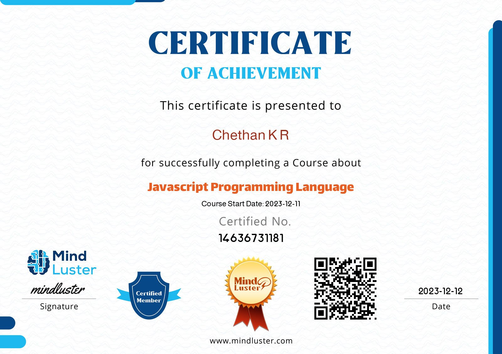

JavaScript Programming in 3 Hours
Welcome to the "JavaScript Programming in 3 Hours" course on MindLuster! This course is designed to provide you with a fast-paced and comprehensive introduction to JavaScript.

Course Overview
Duration: 3 hours
Skill Level: Beginner to Intermediate
Platform: MindLuster
Instructor: [Giraffe Academy]
Course Content
Introduction to JavaScript

Basics of JavaScript
Setting up your development environment
Data Types and Variables

Understanding data types
Working with variables and constants
Control Flow and Functions

Conditional statements
Loops and functions
Arrays and Objects

Manipulating arrays
Working with objects
DOM Manipulation

Interacting with the Document Object Model (DOM)
Handling events
Asynchronous JavaScript

Introduction to asynchronous programming
Promises and callbacks
Project

Apply your knowledge in a hands-on project
Prerequisites
Basic understanding of HTML and CSS
Getting Started
Clone the repository:

bash
Copy code
git clone https://github.com/Chethan814/mind-luster-js-programming-basic.git
Navigate to the project folder:

bash
Copy code
cd javascript-in-3-hours
Follow the instructions in the course materials to start learning.

Certification
Upon completion of the course, you will receive a certification of completion. You can showcase your achievement by adding the certification image to your GitHub profile.

Certification 

Support and Feedback
If you encounter any issues or have questions, feel free to open an issue. Your feedback is highly appreciated!

License
This project is licensed under the MIT License.
